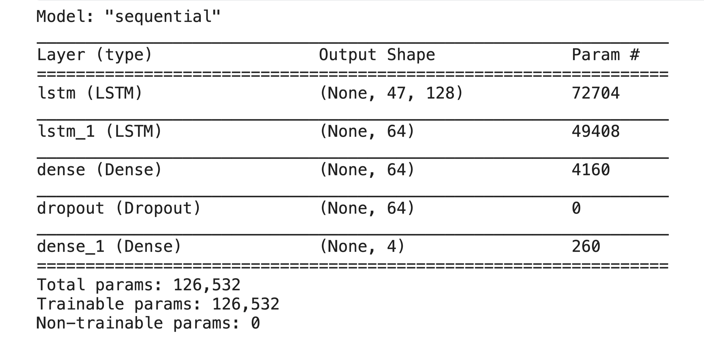

# Speech Emotion Recognition using TinyML

Welcome to the repo! This project aims to develop an efficient and compact speech emotion recognition model suitable for TinyML applications. The repo consists of two parts:

1. Develop and convert the LSTM model in TensorFlow to the TensorFlow “Lite” model. ([01_TFLite_Model_Preparation.ipynb](https://github.com/Hannibal0420/Speech-Emotion-Recognition-TinyML/blob/main/01_TFLite_Model_Preparation.ipynb))
2. Make inferences on the TensorFlow Lite model with the [Arduino Nano 33 BLE](https://docs.arduino.cc/hardware/nano-33-ble) microcontroller. ([02_Arduino_Nano_Inference.ipynb](https://github.com/Hannibal0420/Speech-Emotion-Recognition-TinyML/blob/main/02_Arduino_Nano_Inference.ipynb))

## Requirements

---

**Python Packages** 

**(with Python** `3.7.10`)

- IPython==8.10.0
- numpy==1.23.5
- pandas==1.2.3
- matplotlib==3.7.0
- seaborn==0.11.1
- librosa==0.10.0
- scikit-learn==0.24.1
- tensorflow==2.11.0

**Installation**

To run this project, please follow these steps:

1. Clone the repo.
    
    ```bash
    git clone https://github.com/Hannibal0420/Speech-Emotion-Recognition-TinyML.git
    ```
    
2. Install the required dependencies by running the following command:
    
    ```bash
    pip install -r requirements.txt
    ```
    

## **Usage**

To use this code, run the main code in the provided notebook. You can customize the inputs and arguments as needed. The notebook contains detailed instructions on how to use the code.

## **Data Description**

In this project, I use three popular datasets widely used in research for speech emotion recognition tasks: RAVDESS (Ryerson Audio-Visual Database of Emotional Speech and Song), TESS (Toronto Emotional Speech Set), and SAVEE (Surrey Audio-Visual Expressed Emotion) datasets.

- The RAVDESS dataset contains 7356 files with speech and song recordings of 24 professional actors performing in 8 different emotions (neutral, calm, happy, sad, angry, fearful, surprised, and disgusted). It includes both acted and improvised speech and song. The dataset can be downloaded from **[this link](https://www.kaggle.com/datasets/uwrfkaggler/ravdess-emotional-speech-audio)**.
- The TESS dataset consists of 2800 files with naturalistic speech recordings performed by two actors (one male, one female), expressing 7 different emotions (anger, disgust, fear, happiness, pleasant surprise, sadness, and neutral). The dataset can be downloaded from **[this link](https://www.kaggle.com/datasets/ejlok1/toronto-emotional-speech-set-tess)**.
- The SAVEE dataset contains 480 files of acted speech by 4 male speakers, expressing 4 different emotions (neutral, happy, angry, and sad) with varying levels of intensity. The dataset can be downloaded from **[this link](https://www.kaggle.com/datasets/ejlok1/surrey-audiovisual-expressed-emotion-savee)**.

These datasets provide a diverse range of speech recordings with various emotions, making them suitable for training machine learning models for speech emotion recognition. On the other hand, feature extraction is performed using Mel-frequency cepstral coefficients (MFCC), while dataset augmentation is achieved through a series of audio transformations, including noise addition, time stretching, and pitch shifting. These transformations yield a diversified dataset, enabling the model to generalize to novel data better.

<p align="center">
  
</p>

## **Model Description**

The presented TinyML project employs a sequential deep-learning model with two LSTM layers (128 and 64 units) for processing temporal data. The model is followed by a fully connected layer and a dropout layer for regularization. The final dense layer has a softmax activation, catering to a 4-class classification. The model is compiled with an Adam optimizer for efficient gradient-based optimization.

<p align="center">
  
</p>


## **Results**

<p align="center">
  
</p>

The initial model, implemented using TensorFlow, achieved an overall accuracy of 72.88% in recognizing emotions such as Neutral, Happy, Surprise, and Unpleasant. The model demonstrated the best performance in identifying neutral emotions, while the recognition of surprise and happy emotions showed room for improvement (saved as “Speech-Emotion-Recognition-Model.h5”).

<p align="center">
  
</p>

The original model was converted to TensorFlow Lite format to optimize the deployment model for resource-constrained devices, resulting in a significant size reduction from 1.5 MB to 515 KB (saved as “SER.tflite”). Furthermore, post-training quantization was employed to transform the model's weights from float32 to int8 format, leading to an even smaller model size of 150 KB (saved as “SER_quant.tflite”), which is approximately 3.4 times smaller than the non-quantized TensorFlow Lite model and 10 times smaller than the original model.

A comparative analysis of the quantized TensorFlow Lite model and the original model revealed that the quantized model maintained a similar level of accuracy (73.06%) while significantly improving inference time. When tested with 100 sample inputs, the inference time of the original model was 4.391 seconds, while the quantized TFLite model completed the task in just 0.299 seconds. The results demonstrate that the optimized quantized model maintains satisfactory performance while significantly improving efficiency and size, making it a suitable candidate for TinyML applications.

In conclusion, this project highlights the effectiveness of model optimization techniques, such as TensorFlow Lite conversion and post-training quantization, in developing compact and efficient speech emotion recognition models for resource-constrained environments. Future work could focus on further enhancing the model's performance, particularly in recognition of surprise and happy emotions.

## **Future Work**

- Deploy independent inference on the microcontroller
- Filter the signal input from the microcontroller
- Explore other model architectures for SER
- Incorporate other audio features

## **License**

This project is licensed under the MIT License - see the **[LICENSE](https://github.com/Hannibal0420/Speech-Emotion-Recognition-TinyML/blob/main/LICENSE)** file for details.

Thank you for using the repo. Don't hesitate to provide your thoughts—I'm eager to learn and improve alongside you. Best wishes!

## Acknowledgments

The Arduino code of this project was built using code from the Active Learning Labs - tinyMLx course at Harvard University. The original code can be found at: https://github.com/tinyMLx/arduino-library

Modifications:

- Hannibal: slightly modified “test_microphone.ino” to set up the microphone on Arduino.
